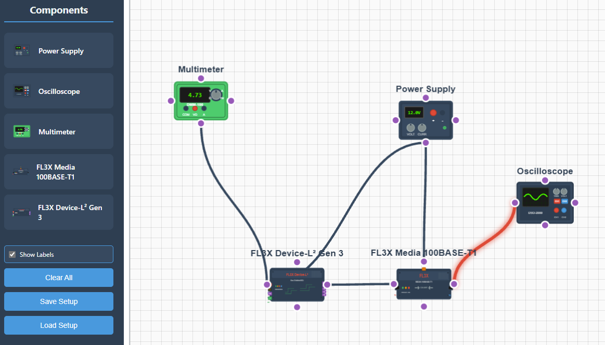

# Hardware Setup Visualizer

A web-based tool for visualizing FL3X automotive electronics test setups and component connections.

## Features

### **Core Functionality**
- **Drag & Drop**: Place components from the toolbox onto the canvas
- **Wire Creation**: Click connector points to create wire connections between components
- **Canvas Navigation**: Zoom with scroll wheel, pan with middle-click and drag

### **Component Management**
- **Component Selection**: Right-click components to access context menu
- **Component Mirroring**: Flip connector layouts to opposite sides
- **Component Labeling**: Toggle connection point names and connector types
- **Move Components**: Click and drag to reposition

### **Wire Management**
- **Visual Selection**: Click wires to select and highlight them
- **Delete Wires**: Double-click wires or press Delete/Backspace

### **Storage**
- **Save/Load**: Export and import complete setups as JSON files
